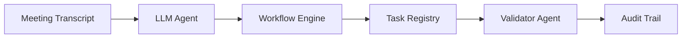
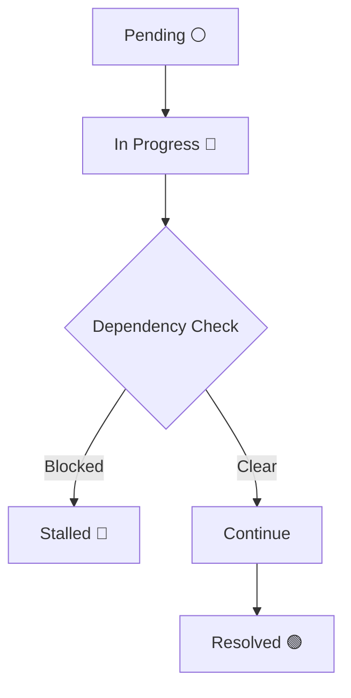

#  Autonomous Enterprise Workflow Engine
### *Next-Gen Multi-Agent Meeting Intelligence & Task Automation*

<p align="center">
  
  
  
  
  
</p>

---

## Overview

An **Agentic AI system** that converts unstructured meeting transcripts into **intelligent, executable workflows** — with minimal human intervention and full transparency.

* Extracts decisions using LLMs
* Assigns owners & priorities automatically
* Maps task dependencies intelligently
* Simulates autonomous execution cycles
* Maintains a complete audit trail of all actions

---

## Problem Statement

Build a system that can:

* Manage **multi-step enterprise workflows**
* Detect failures and **self-correct dynamically**
* Execute tasks with **minimal manual intervention**
* Maintain a **fully auditable and explainable decision trail**

---

## System Architecture



---

## Multi-Agent System

| Agent                          | Responsibility                                         |
| ------------------------------ | ------------------------------------------------------ |
| **LLM**                     | Extracts structured decisions and assigns ownership    |
| **Logic Engine**            | Handles dependencies, state transitions, and execution |
| **Validator**               | Verifies completion and records all system actions     |

---

## Core Capabilities

* AI-powered decision & task extraction
* Dependency-aware workflow execution
* Autonomous task lifecycle management
* Real-time interactive dashboard (Gradio)
* Fully explainable audit logging

---

## Execution Lifecycle



---

## Tech Stack

| Layer      | Technology         |
| ---------- | ------------------ |
| AI Layer   | Llama-3 (Groq API) |
| Backend    | Python             |
| Interface  | Gradio             |
| Data Layer | Pandas             |

---

## Project Structure

```
etimes-ai-workflow/
│
├── src/              # Core system (agents, workflow engine)
├── notebook/         # Interactive Colab demo
├── data/             # Sample inputs
├── outputs/          # Sample outputs
├── images/           # UI & architecture visuals
├── docs/             # Approach & design notes
│
├── README.md
├── requirements.txt
└── .gitignore
```

---

## Setup & Run

```bash
git clone <your-repo-link>
cd etimes-ai-workflow
pip install -r requirements.txt
python src/main.py
```

### Quick Demo (Colab)

* **Run Demo (Colab)**  
[Open Notebook](https://github.com/<your-username>/<your-repo>/blob/main/notebook/demo.ipynb)

- Add API key via secrets  
- Run all cells

---

## Security & Reliability

* Secure API key handling (no hardcoding)
* No persistent storage of sensitive data
* Input validation for safe processing
* Controlled and minimal dependency usage

---

## Auditability

Every system action is **logged, traceable, and verifiable**, ensuring enterprise-grade transparency.

### Sample Audit Trail

| Time  | Agent       | Event             | Description                    |
| ----- | ----------- | ----------------- | ------------------------------ |
| 05:31 | Planner  | Task Indexed      | Extracted decision → Task #1   |
| 05:31 | Planner  | Task Indexed      | Extracted decision → Task #2   |
| 05:31 | Executor | Execution Started | Task #1 moved to *In Progress* |
| 05:31 | Executor | Execution Started | Task #2 moved to *In Progress* |
| 05:31 | Auditor  | Validation        | Task #1 marked as *Resolved*   |

### Guarantees

* **Full Traceability** → Every action tied to agent & timestamp
* **Explainable Decisions** → Clear path from input → execution
* **Failure Visibility** → Stalled tasks tracked via dependencies
* **Audit-Ready Logs** → Structured for monitoring & debugging

> Full logs are visible in the live dashboard during execution.

---

## Key Challenges & Solutions

| Challenge                             | Solution                                                                    |
| ------------------------------------- | --------------------------------------------------------------------------- |
| Handling non-linear task dependencies | Designed a dependency-aware state engine to dynamically stall/unblock tasks |
| Ensuring structured AI output         | Enforced strict JSON response format from LLM                               |
| Maintaining explainability            | Built a dedicated audit trail tracking every agent action                   |

> These design decisions ensure the system remains reliable, interpretable, and production-ready.

---

## Summary

This system demonstrates how **Agentic AI** evolves from passive assistance to **active, autonomous execution**, combining:

* Intelligence (LLMs)
* Logic (Workflow Engine)
* Transparency (Audit Trail)

---

<p align="center">
  <b>Economic Times Hackathon • Agentic AI Track</b><br>
  <i>Built for autonomous enterprise workflows</i>
</p>
